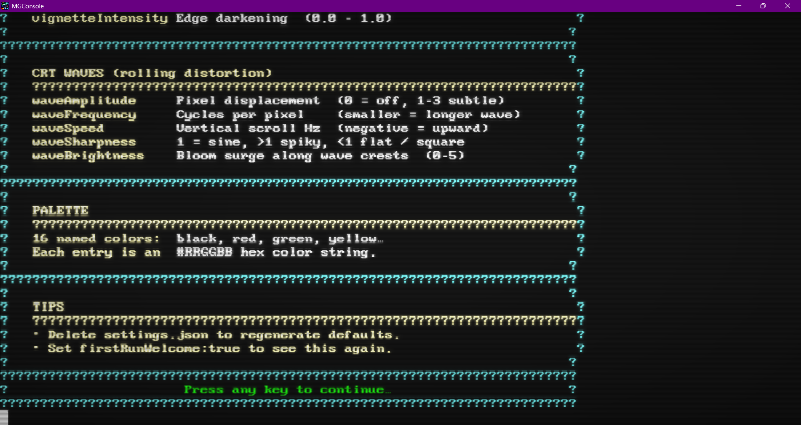
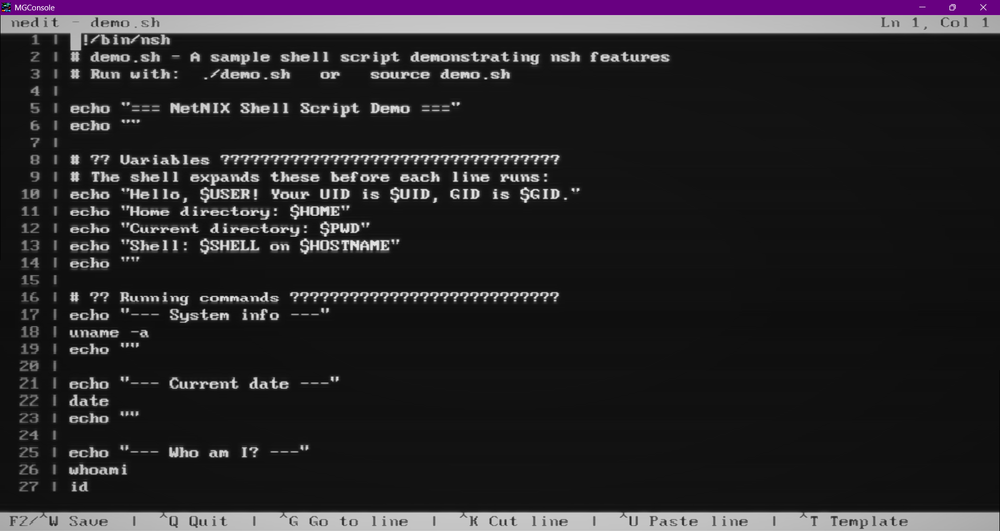

# MGConsole

A **hardware-accelerated terminal emulator** built entirely in [MonoGame](https://monogame.net/), with an old-school CRT post-process effect — phosphor bloom, scanlines, vignette, and slow rolling wave distortion — rendered in real time on the GPU.

It hosts real console processes (`cmd.exe`, `powershell.exe`, your own CLI tools, TUI apps, whatever you like) through the Windows **ConPTY** pseudoconsole API, and renders their output using a fully code-generated bitmap font — no external assets, no Content Pipeline, no `.xnb` files, **no HLSL shaders**.

<p align="center">
  
</p>

---

## Features

- **Real pseudoconsole hosting** via Win32 ConPTY — full VT/ANSI support, cursor positioning, alternate screen, 16-color SGR, scroll regions, and more
- **VT100 / xterm terminal emulator** — parses escape sequences in software; compatible with `cmd.exe`, PowerShell, `msedit`, `more`, and C# [Terminal.Gui](https://github.com/gui-cs/Terminal.Gui) apps
- **Code-generated bitmap font** — an 8×16 VGA-style glyph atlas built entirely at runtime from byte arrays; zero external asset dependencies
- **Extended Unicode glyph set** — box-drawing (single + double + mixed), block elements, shading, geometric shapes, arrows, card suits, mathematical symbols, and more; covers the full CP437 TUI character set
- **CRT post-process effect** (no shader file required) — multi-mip bilinear bloom, horizontal scanlines, radial vignette, and slow rolling **wave distortion** with sub-pixel rendering and crest-bloom intensification
- **Fractional font scaling** — set `fontScale` to any decimal (e.g. `1.5`, `2.25`); the grid stays on whole pixel boundaries while glyphs interpolate smoothly
- **Resizable window** with two modes: *Reflow* (cols/rows adjust to window size) and *Stretch* (fixed grid scaled to fill)
- **First-run welcome screen** — an in-terminal styled guide explaining every setting, shown once, dismissed by any keypress
- **Fully configurable** via a plain JSON settings file next to the `.exe`, with a named-color palette and durable user edits

---

## Screenshots

### First-run welcome screen
The styled in-terminal guide that explains every setting on first launch — rendered through the full CRT pipeline.

<p align="center">
  
</p>

### `msedit` — running the classic MS-DOS editor through ConPTY
Full TUI app support: menu bars, dialogs, scrollbars, double-line box drawing, and 16-color palette.

<p align="center">
  
  
</p>

### Terminal.Gui-style apps and editors
TUI applications render correctly through the VT/ANSI parser, including reverse-video, bold, scroll regions, and the extended Unicode glyph set.

<p align="center">
  
  
</p>

<p align="center">
  
</p>

---

## Requirements

| Requirement | Version |
|---|---|
| Windows | 10 version 1903 or later (ConPTY requirement) |
| .NET | 8.0 |
| MonoGame | 3.8.x (WindowsDX) |

> MGConsole is Windows-only. ConPTY is a Windows API.

---

## Getting Started

### Build

```bash
git clone https://github.com/squiblez/MGConsole.git
cd MGConsole
dotnet build
```

### Run

```bash
dotnet run --project MGConsole
```

Or open `MGConsole.sln` in Visual Studio and press **F5**.

On first launch a `settings.json` file is written next to the `.exe`. Edit it to configure the terminal before the next run.

---

## Configuration

All settings live in **`settings.json`** alongside the `.exe`. The file is created automatically with defaults on first run and is never overwritten by subsequent runs — your edits are always preserved.

```jsonc
{
  "cols": 100,                 // Terminal width in characters
  "rows": 30,                  // Terminal height in characters
  "resizable": true,           // Allow window resizing
  "autoExec": "cmd.exe",       // Process to launch on startup
  "restartOnExit": true,       // true = relaunch autoExec when it exits,
                               // false = close MGConsole when it exits
  "fontScale": 1.0,            // Glyph scale multiplier (decimals OK: 1.5, 2.25, ...)
  "resizeMode": "Reflow",      // "Reflow" (cols/rows change) or "Stretch" (grid scales)
  "firstRunWelcome": true,     // Show the in-terminal welcome guide on next launch

  // CRT effect master toggle
  "crtEffect": true,

  // Bloom / scanline / vignette
  "glowIntensity":     1.5,    // Phosphor bloom strength    (0 = off, ~6 = strong)
  "scanlineIntensity": 0.25,   // Horizontal scanline darkness (0 – 1)
  "vignetteIntensity": 0.25,   // Radial edge darkening        (0 – 1)

  // CRT rolling wave distortion (slow horizontal jitter scrolling vertically)
  "waveAmplitude":  0.8,       // Pixel displacement amount  (0 = off, 1–3 subtle)
  "waveFrequency":  0.001,     // Cycles per destination pixel along Y
  "waveSpeed":      0.4,       // Cycles per second the wave scrolls (negative = up)
  "waveSharpness":  1.0,       // 1 = pure sine, >1 spiky crests, <1 flat / square
  "waveBrightness": 0.8,       // Bloom surge along wave crests (0 = none, 0.5–1.5 natural)

  // 16-color VGA palette — edit any entry by name
  "palette": {
    "black":         "#0C0C0C",
    "red":           "#C50F1F",
    "green":         "#13A10E",
    "yellow":        "#C19C00",
    "blue":          "#0037DA",
    "magenta":       "#881798",
    "cyan":          "#3A96DD",
    "white":         "#CCCCCC",
    "brightBlack":   "#767676",
    "brightRed":     "#E74856",
    "brightGreen":   "#16C60C",
    "brightYellow":  "#F9F1A5",
    "brightBlue":    "#3B78FF",
    "brightMagenta": "#B4009E",
    "brightCyan":    "#61D6D6",
    "brightWhite":   "#F2F2F2"
  }
}
```

### Tuning the wave distortion

The wave parameters interact, so here are some preset combos to start from:

| Look | `waveAmplitude` | `waveFrequency` | `waveSpeed` | `waveSharpness` | `waveBrightness` |
|---|---|---|---|---|---|
| Off                          | 0   | –     | –    | –   | –   |
| Subtle vintage (default)     | 0.8 | 0.001 | 0.4  | 1.0 | 0.8 |
| Mild rolling                 | 1.5 | 0.025 | 0.4  | 1.0 | 0.6 |
| Failing horizontal hold      | 3.0 | 0.04  | 0.8  | 0.6 | 1.2 |
| Magnetic interference pulses | 1.0 | 0.02  | 1.5  | 3.0 | 2.0 |
| Slow phosphor sway           | 1.0 | 0.012 | 0.15 | 1.0 | 0.4 |
| Old TV vertical roll         | 4.0 | 0.05  | 0.3  | 0.5 | 1.5 |

### Launching a different shell

Change `autoExec` to point at any console application:

```jsonc
"autoExec": "powershell.exe"
"autoExec": "pwsh.exe"
"autoExec": "wsl.exe"
"autoExec": "python.exe"
```

---

## How It Works

### ConPTY — process hosting

`ConPty.cs` wraps the Windows **CreatePseudoConsole** / **CreateProcess** API. A pair of anonymous pipes connects MGConsole to the child process: one pipe carries input (keystrokes we write) and one carries output (VT escape sequences we read). This is the same mechanism used by Windows Terminal.

The child process sees a real console with the requested dimensions and can use the full Win32 Console API — color output, cursor movement, alternate screen buffers, etc. — all of which arrives at MGConsole as a stream of UTF-8 VT/ANSI sequences.

### TerminalScreen — VT/ANSI parser

`TerminalScreen.cs` maintains a 2D `Cell[rows, cols]` grid. Each cell stores a character, a foreground color, and a background color. The `Feed(ReadOnlySpan<char>)` method implements a state machine that processes:

- **C0 controls** — `\r`, `\n`, `\b`, `\t`, BEL
- **ESC sequences** — save/restore cursor, charset designators, line feed
- **CSI sequences** — cursor movement (A–H), erase (J/K), insert/delete lines and characters, scroll regions, SGR color/attribute codes (bold, reverse, 16-color palette)
- **OSC sequences** — consumed and discarded (window title etc.)

The screen supports full scroll regions, reverse-video, bold, and the 16-color VGA palette. It is thread-safe for `Feed` + `Draw` concurrency via a lock held by `Game1`.

### ConsoleFont — code-generated glyph atlas

`ConsoleFont.cs` generates a `Texture2D` font atlas entirely from code at startup — no `.spritefont`, no `.png`, no Content Pipeline.

**ASCII glyphs (U+0020 – U+007E)** are encoded as a flat `byte[]` array: 16 bytes per character, one byte per row, MSB = leftmost pixel. This is a classic 8×16 VGA bitmap font.

**Extended glyphs** are added to the atlas via `BuildExtraGlyphs()`, which returns a list of `(codepoint, byte[16])` entries generated by several helpers:

| Helper | Used for |
|---|---|
| `BoxGlyph(top, bottom, left, right)` | Single-line box drawing — procedurally computes the correct crossing/T/corner pixels |
| `B(string)` | Multi-line ASCII art patterns (`.` = off, `X` = on) — used for hand-drawn glyphs |
| `BlockRows` / `BlockCols` | Filled rectangular block elements (▀▄█▌▐ etc.) |
| `ShadeGlyph(density)` | Dithered shade patterns (░▒▓) |

The full extended set covers:

- Box drawing — single line `─│┌┐└┘├┤┬┴┼`, double line `═║╔╗╚╝╠╣╦╩╬`, and all 18 mixed single/double variants
- Block elements — all 20 Unicode block characters (▀–▕)
- Shade blocks — ░ ▒ ▓
- Geometric shapes — ■ □ ● ○ ▲ ▼ ◄ ► ◆ ◇
- Arrows — ← → ↑ ↓ ↔ ↕
- Latin symbols — ° ± × ÷ £ ¥ § © ® µ ¶ ¿ ¡ « » ¢ • … – —
- Card suits and fun — ♠ ♣ ♥ ♦ ☺ ☻ ★ ♪

Rendering uses `TryGetGlyph(int codepoint, out Rectangle rect)` which returns the source rectangle in the atlas for any supported codepoint, covering both the ASCII and extended sets.

### Game1 — render pipeline

Each frame is composited in three GPU passes with zero render-target ping-pong after the back buffer is first touched:

```
┌─────────────────────────────────────────────────────────────┐
│ Pass 1 — Terminal render (offscreen)                        │
│   SetRenderTarget(_sceneTarget)                             │
│   Draw backgrounds + glyphs + cursor  (PointClamp)         │
├─────────────────────────────────────────────────────────────┤
│ Pass 2 — Bloom mip chain (offscreen, all before back buffer)│
│   _sceneTarget  → bloomMip[0]  ½ size  (LinearClamp blit)  │
│   bloomMip[0]   → bloomMip[1]  ¼ size  (LinearClamp blit)  │
│   bloomMip[1]   → bloomMip[2]  ⅛ size  (LinearClamp blit)  │
├─────────────────────────────────────────────────────────────┤
│ Pass 3 — Composite to back buffer (single uninterrupted)    │
│   SetRenderTarget(null)                                     │
│   a) _sceneTarget   Opaque       sharp base                 │
│        └ if waveActive: drawn as wavy horizontal slices     │
│   b) bloomMip[0..2] Additive     tight → wide glow bands    │
│        └ if waveActive: sliced + crest-brightness boost     │
│   c) _scanlineTex   AlphaBlend   horizontal scanlines       │
│   d) _vignetteTex   AlphaBlend   radial edge darkening      │
└─────────────────────────────────────────────────────────────┘
```

**Why all offscreen work happens before touching the back buffer:** DirectX treats the back buffer as `DiscardContents` — switching away from it mid-frame invalidates its previous contents. The pipeline is structured so `SetRenderTarget(null)` is called exactly once, and the back buffer is only drawn into during Pass 3.

**Bloom quality:** Each bilinear downsample step averages a 2×2 neighbourhood, functioning as a box blur. Three cascaded halvings approximate a Gaussian blur over an ⅛-scale image. The three mip levels composite as distinct glow bands: tight bright core (mip 0), medium phosphor halo (mip 1), wide ambient haze (mip 2). No HLSL shader required.

**Wave distortion (`DrawWavySlices`):** When `waveAmplitude > 0`, the destination rectangle is split into a vertical stack of horizontal slices (slice height adapts to the wavelength). Each slice is drawn at its source band but with a horizontal offset of `amplitude · sign(sinφ) · |sinφ|^sharpness`, where `φ = 2π·(y·frequency + t·speed)`. Offsets are kept as floats and rendered with `LinearClamp` and the `Vector2`-position `SpriteBatch.Draw` overload, giving true sub-pixel motion. The same wave function is applied to the bloom mips, with each slice's tint additionally multiplied by `(1 + waveBrightness · |shape|)` so the bloom **surges** along the displacement crests — mimicking the way an electron beam lights phosphor more brightly where it's being deflected.

---

## Architecture Overview

```
MGConsole/
├── Program.cs          Entry point — runs the MonoGame loop
├── Game1.cs            MonoGame Game subclass — update/draw, keyboard input, resize
├── TerminalScreen.cs   VT/ANSI state machine + Cell[,] grid
├── ConPty.cs           Win32 ConPTY wrapper (CreatePseudoConsole, pipes, process)
├── ConsoleFont.cs      Code-generated 8×16 bitmap font atlas (ASCII + extended Unicode)
├── Settings.cs         JSON settings loader/saver
└── settings.json       User config (auto-generated on first run)
```

---

## Use Cases

- **Retro aesthetics** — CRT shaders, old-school demos, amber/green phosphor terminal look
- **Game UIs** — embed a real working terminal inside a MonoGame game
- **TUI app showcase** — run [Terminal.Gui](https://github.com/gui-cs/Terminal.Gui) apps, `msedit`, `htop`-style tools inside a styled window
- **Learning** — a from-scratch reference implementation of a pseudoconsole host + VT parser + bitmap font renderer
- **Streaming / recording** — styled terminal window for screen captures

---

## License

MIT — see [LICENSE](LICENSE) for details.
